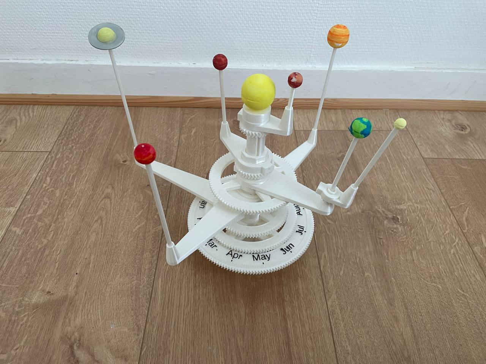
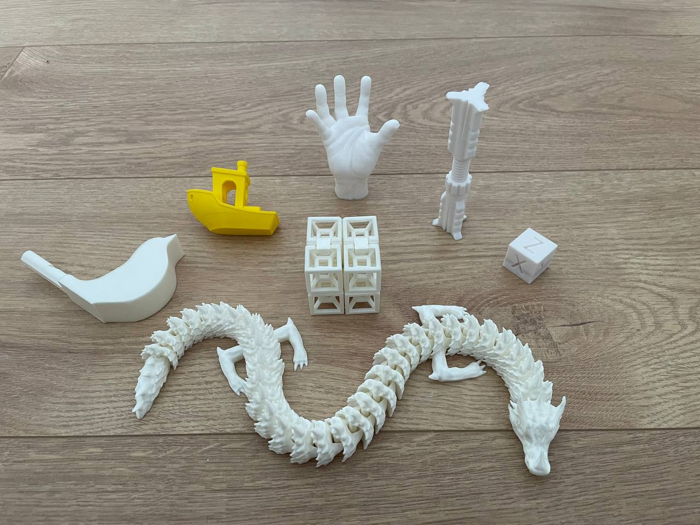
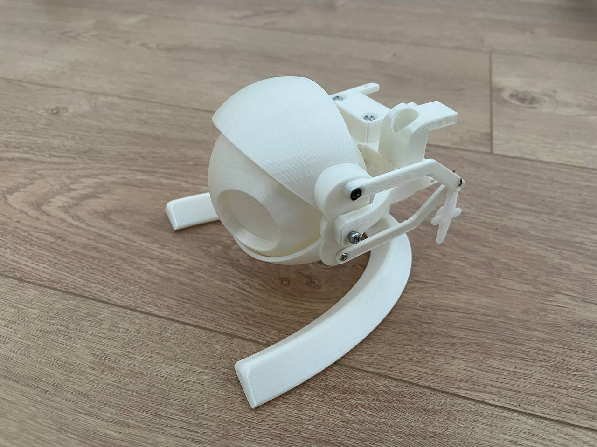
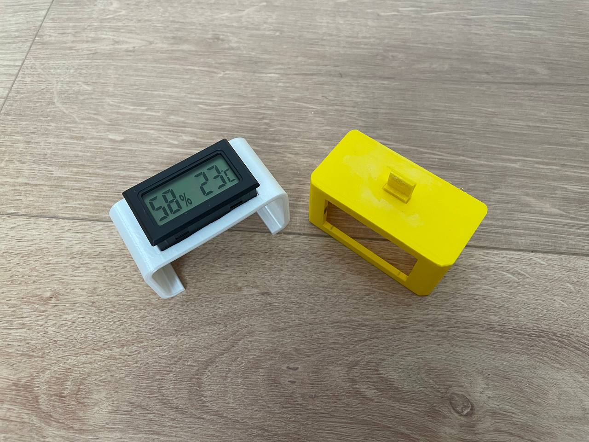

# 3D_Printing_Projects

Here you can find some of the D printing projects I realized:

- [Alexa Echo Flex support for Themperature and Humidity sensor](https://www.thingiverse.com/thing:5211923)

- Moving Eye Ball

- Planetarium

